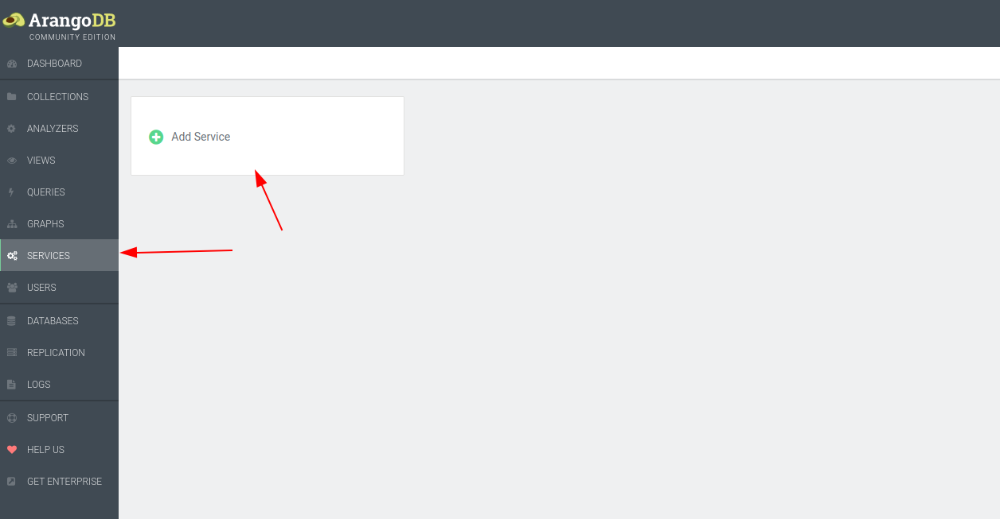
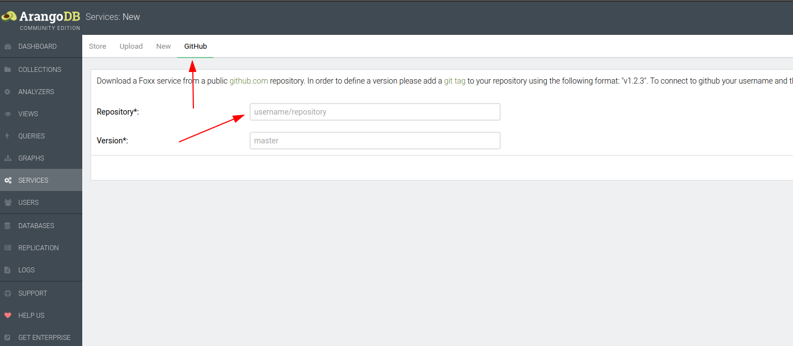

# arangodb-armor-example

## Installation

```bash
yarn
docker run -p 8529:8529 -e ARANGO_ROOT_PASSWORD=openSesame arangodb/arangodb:3.9.2
```

1. Head to Webview: [http://localhost:8529](http://localhost:8529)

2. Credentials: `root:openSesame`

3. Create new service using Github and `Escape-Technologies/arangodb-armor-example` path.




## Sources

Scripts and schema from: [https://github.com/arangodb-foxx/demo-graphql](https://github.com/arangodb-foxx/demo-graphql)

## Testing

### GraphQL Reserverd keyword

```GraphQL
query {
    __typename
}
```

### Valid Query

```GraphQL
query {
    hero(episode: "NewHope") {
        name
        friends(species: DROID) {
            name
        }
    }
}
```

### Field Suggestion disabled

```GraphQL
query {
    hero(episode: "NewHope") {
        namee
    }
}
```

### Cost Limit

```GraphQL
query {
    ...HeroFragment
    ...HeroFragment
    ...HeroFragment
}

fragment HeroFragment on Query {
    hero(episode: "NewHope") {
        name
        friends(species: Droid) {
            name
        }
    }
}
```

### Max aliases

```GraphQL
query {
    firstHero: hero(episode: "NewHope") {
        name
    }
  
    secondHero: hero(episode: "NewHope") {
        name
    }

    thirdHero: hero(episode: "NewHope") {
        name
    }
}
```

### Max depth

```GraphQL
query {
    hero(episode: "NewHope") {
        name
        friends(species: DROID) {
            name
            friends(species: DROID) {
                name
                friends(species: DROID) {
                    name
                }
            }
        }
    }
}
```

### Max Directives

```GraphQL
query {
    hero(episode: "NewHope") {
        name
        friends(species: DROID) @a@a@a@a@a@a@a@a@a@a@a@a@a@a@a@a@a@a@a@a@a {
            name
        }
    }
}
```
